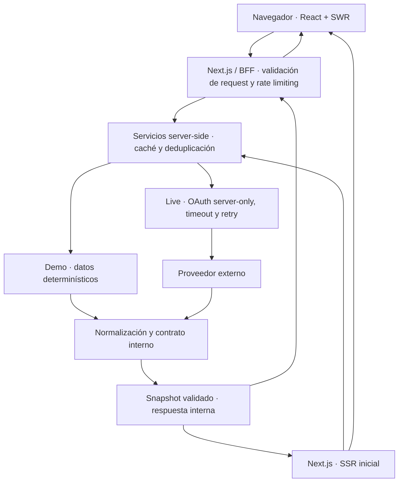

# Argentina Market Tracker

[](https://github.com/emanuel-tivano/argentina-market-tracker/actions/workflows/ci.yml)


Dashboard full-stack del mercado argentino con paneles, favoritos, cotizaciones detalladas e histórico. Un proyecto de portfolio construido con **Next.js, React y TypeScript**, centrado en integración de datos y comportamiento ante fallos.

El desafío técnico está en reunir fuentes con contratos distintos, validar sus respuestas y mantener una interfaz útil cuando el proveedor falla. La aplicación combina SSR, un Backend for Frontend (BFF), OAuth server-only, cachés y control de concurrencia, con rate limiting, observabilidad y testing automatizado.

**[Ver demo](https://argentina-market-tracker.vercel.app)** · [Código](https://github.com/emanuel-tivano/argentina-market-tracker) · [Ejecutar localmente](#ejecución-local) · [Testing](#testing-y-calidad)

La demo utiliza datos sintéticos. El proyecto no es un broker, no ejecuta operaciones financieras ni ofrece asesoramiento financiero.


## Highlights técnicos

- **SSR + SWR:** contenido inicial desde el servidor y revalidación cliente; el polling de paneles se pausa cuando la pestaña está oculta.
- **BFF interno:** el navegador consume rutas propias. OAuth y las llamadas al proveedor permanecen en el servidor; los contratos se validan antes de la UI.
- **Caché fresh/stale:** snapshots con vigencia explícita y fallback acotado ante fallos recuperables; una lectura fresh no espera un refresh del panel.
- **Concurrencia controlada:** deduplicación in-flight por clave, fan-out acotado en Favoritos y caché negativa para cotizaciones con un 404 confirmado.
- **Control y diagnóstico:** rate limiting, request IDs, health checks, métricas agregadas y logs sanitizados.
- **Validación repetible:** modo demo determinístico, tests de contratos, servicios y UI, más CI con cobertura y E2E sobre un build de producción.

## Qué construí

Diseñé e implementé el proyecto de punta a punta:

- La arquitectura App Router y la separación entre UI, contratos, BFF y servicios.
- El dashboard responsive, favoritos, detalle de activos, histórico y temas.
- La integración upstream con OAuth, normalización, SSR y políticas de caché.
- Los límites de requests y concurrencia, la observabilidad, los tests, CI y la documentación técnica y operativa.

Elegí mantener una fuente demo dentro de la misma arquitectura para que el proyecto pueda revisarse sin credenciales ni dependencia de la disponibilidad del proveedor.

## Arquitectura

El navegador nunca accede al proveedor externo. Los Route Handlers validan las requests públicas y aplican rate limiting; los servicios resuelven la fuente, la caché y la normalización de la respuesta.



El SSR inicial utiliza los servicios directamente y entrega datos a los componentes cliente. Las actualizaciones posteriores pasan por el BFF. La caché evita repetir la consulta externa cuando hay un snapshot vigente. Las responsabilidades quedan separadas en tres áreas:

- `src/features/dashboard/`: componentes, hooks y estado cliente.
- `src/lib/`: contratos compartidos, validadores y normalizadores.
- `src/lib/server/`: integración externa, cachés, límites y observabilidad.

El mapa de archivos y flujos está en [ESTRUCTURA_PROYECTO.md](./ESTRUCTURA_PROYECTO.md).

## Decisiones técnicas

| Decisión | Problema resuelto | Trade-off |
| --- | --- | --- |
| BFF interno | Aísla OAuth y adapta los contratos del proveedor. | Suma una capa que necesita validación y tests propios. |
| SSR + SWR | Entrega datos iniciales y permite revalidarlos en el cliente. | Hay que coordinar hidratación, errores e identidad de cada consulta. |
| Caché fresh/stale + deduplicación | Reduce llamadas repetidas y conserva snapshots ante fallos recuperables. | Los datos pueden estar desactualizados; su edad está acotada y se informa. |
| Caché negativa por recurso | Evita repetir consultas de símbolos que devolvieron 404. | El símbolo puede seguir figurando como ausente hasta vencer el TTL; detalle y Favoritos no comparten negativos. |
| Fan-out acotado en Favoritos | Limita las consultas simultáneas al proveedor. | Los lotes grandes tardan más y pueden devolver resultados parciales. |
| Rate limiting configurable | Limita requests públicas y consultas upstream. | El alcance distribuido requiere Redis REST y una identidad de cliente confiable. |
| Demo/live | Permite una revisión repetible y una integración externa real. | La demo es sintética; live depende del proveedor. |

## Funcionalidades

- Panel líder, panel general y CEDEARs, con ordenamiento de cotizaciones.
- Favoritos persistidos localmente y actualizados al activar ese panel.
- Detalle de activos con cotización, sesión, liquidez y puntas de compra/venta.
- Histórico por rango, con estados de carga, error, vacío y datos desactualizados.
- Modal en desktop y página de detalle en mobile; temas claro y oscuro.
- Metadata por activo, canonical, sitemap, robots y Open Graph.


Más vistas: [dashboard desktop](./docs/screenshots/desktop.png) · [dashboard mobile](./docs/screenshots/mobile.png).

## Stack

Versiones declaradas en [package.json](./package.json); las dependencias resueltas están fijadas en [package-lock.json](./package-lock.json).

| Área | Tecnologías |
| --- | --- |
| Aplicación | Next.js `16.3.4` · React `19.2.6` · App Router |
| Tipado | TypeScript `6.0.3` con `strict` |
| UI y datos | Tailwind CSS `^4.3.0` · SWR `2.4.1` · lightweight-charts `^5.2.0` |
| Testing | Vitest + coverage V8 `^4.1.11` · Testing Library · Playwright `^1.60.0` |
| Calidad y runtime | ESLint `^9.39.4` · Node `>=24.15.0 <25` · GitHub Actions |

## Testing y calidad

Las pruebas cubren los límites entre datos externos, servicios y experiencia de usuario:

- Normalizadores y contratos: números financieros, payloads inválidos e identidad y frescura de las respuestas.
- Servicios y cachés: TTL, stale fallback, negativos 404, deduplicación, concurrencia y limpieza de requests en vuelo.
- Route Handlers: validación de entrada, códigos HTTP, headers, request IDs y protección de rutas debug.
- Hooks y componentes: loading/error/empty, favoritos, cambios de activo o rango, y navegación por teclado.
- SSR y E2E: contenido antes de hidratar, navegación, modal e histórico en Chromium desktop y mobile.

La cobertura V8 tiene thresholds globales: statements `80`, lines `80`, functions `75` y branches `70`, además de mínimos específicos para módulos críticos. [vitest.config.ts](./vitest.config.ts) define estos controles. El informe se genera con `npm run test:coverage`; no se versiona.

El [pipeline CI](./.github/workflows/ci.yml) tiene dos jobs encadenados:

1. `quality`: `npm ci`, auditoría de dependencias de producción, lint, type-check y tests con cobertura.
2. `e2e`: instalación aislada, un build de producción y suites SSR y app contra ese mismo build.

Las acciones están fijadas por SHA, con permisos de lectura, timeouts y cancelación de ejecuciones obsoletas. CI utiliza datos demo.

### Comandos de validación

```bash
npm run validate        # lint + type-check + tests + build + SSR/app E2E
npm run test:coverage   # cobertura V8 y thresholds
npm audit --omit=dev    # auditoría de dependencias de producción
```

Antes del primer E2E, instalá Chromium con `npx playwright install chromium`. Para ejecutar por separado: `npm run test`, `npm run test:e2e:ssr` o `npm run test:e2e:app`. `test:e2e`, `test:e2e:ssr` y `test:e2e:app` construyen la app antes de probarla; los runners usan por defecto el puerto `3100`. La referencia completa de comandos está en [AGENTS.md](./AGENTS.md).

## Seguridad

- Credenciales y tokens OAuth exclusivamente server-side; la UI no recibe el token completo ni payloads upstream sin normalizar.
- URLs upstream validadas y endpoints relativos estrictos, con rechazo de traversal y URLs absolutas; las requests con secretos no siguen redirects.
- CSP con nonce en producción, headers de seguridad y APIs con `Cache-Control: no-store`.
- Debug de token sólo fuera de producción, habilitado explícitamente y protegido con `LOCAL_DEBUG_TOKEN`; métricas protegidas por token en producción.
- El rate limiter público falla cerrado si no puede verificar el límite en el store requerido.

Las condiciones por ambiente y los procedimientos de diagnóstico están en [docs/RUNBOOK.md](./docs/RUNBOOK.md).

## Ejecución local

Requiere Node `>=24.15.0 <25` y npm. Desde la raíz del repositorio:

```bash
npm install
cp .env.local.example .env.local
npm run dev
```

Abrí [localhost:3000](http://localhost:3000). El ejemplo configura `demo`: no requiere credenciales externas, base de datos ni seed. En PowerShell también podés copiar el archivo con `Copy-Item .env.local.example .env.local`.

## Demo vs live

- **Demo:** datos sintéticos determinísticos, sin secretos upstream. Permite explorar el portfolio y repetir pruebas sin depender de terceros.
- **Live:** integración real desde el servidor con el proveedor externo. Requiere credenciales y configuración; está sujeta a sus contratos, disponibilidad y límites.

La fuente se selecciona con `MARKET_DATA_SOURCE`. La interfaz identifica el modo demo con el badge «Demo público · datos sintéticos».

## Variables de entorno

| Variable | Para qué sirve |
| --- | --- |
| `MARKET_DATA_SOURCE` | `demo` para explorar; `live` para integración externa. |
| `NEXT_PUBLIC_SITE_URL` | Origen público para metadata y SEO; revisar al desplegar. |
| `API_URL`, `API_USERNAME`, `API_PASSWORD` | Conexión y credenciales del proveedor, sólo en live y sólo en servidor. |

[.env.local.example](./.env.local.example) contiene los endpoints live y las opciones de caché, concurrencia, Redis y debug. Los requisitos de despliegue, rangos y reglas de validación están en el [runbook](./docs/RUNBOOK.md). Los valores reales se configuran fuera del control de versiones.

## Endpoints y operación

| Ruta | Uso |
| --- | --- |
| `GET /api/panel?type=lider` | Panel líder; también admite `general` y `cedears`. |
| `GET /api/favorites?items=bCBA:ALUA,bCBA:AAPL` | Cotizaciones de favoritos. |
| `GET /api/stocks/[symbol]/quote?market=bCBA` | Cotización detallada. |
| `GET /api/stocks/[symbol]/history?range=1M&market=bCBA` | Histórico por activo y rango: `1W`, `1M`, `3M`, `6M`, `1Y`, `3Y`, `5Y`. |
| `GET /api/health/live` · `GET /api/health/ready` | Liveness y readiness. |

[ESTRUCTURA_PROYECTO.md](./ESTRUCTURA_PROYECTO.md) ubica los handlers. El [runbook](./docs/RUNBOOK.md) explica el diagnóstico compatible `/api/health`, métricas, debug, budgets internos, respuestas 429/503 y recuperación ante fallos.

## Limitaciones conocidas

- La demo es sintética; no representa cotizaciones reales.
- Live depende de disponibilidad, contratos y credenciales de un tercero.
- Cachés, deduplicación y métricas en memoria son process-local.
- El rate limiting distribuido requiere Redis REST; en memoria no es global.
- Favoritos realiza consultas individuales con concurrencia acotada.
- No hay base de datos ni persistencia propia del histórico.
- La aplicación no ejecuta órdenes ni ofrece asesoramiento financiero.

## Contacto

- [Emanuel Tivano en GitHub](https://github.com/emanuel-tivano)
- [Repositorio](https://github.com/emanuel-tivano/argentina-market-tracker)
- [Demo](https://argentina-market-tracker.vercel.app)
